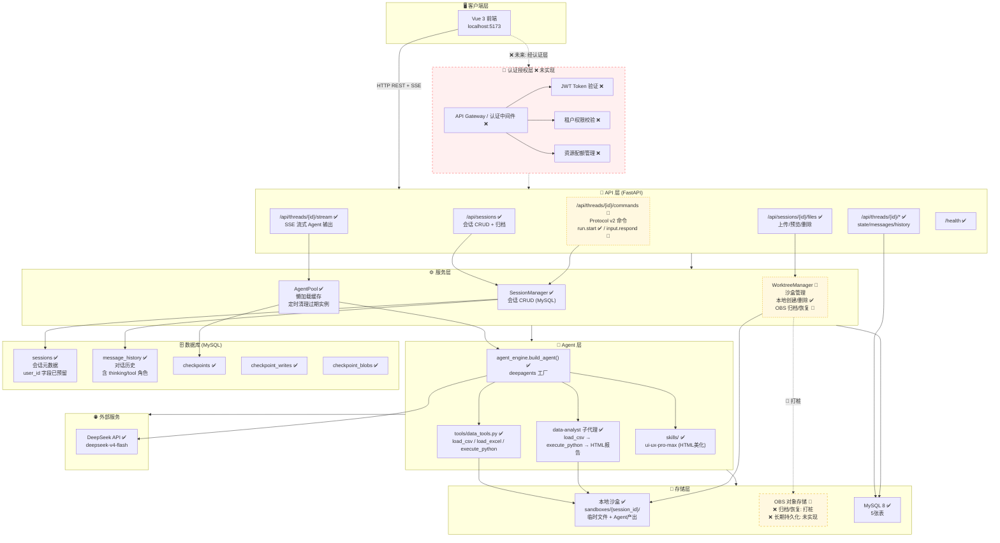
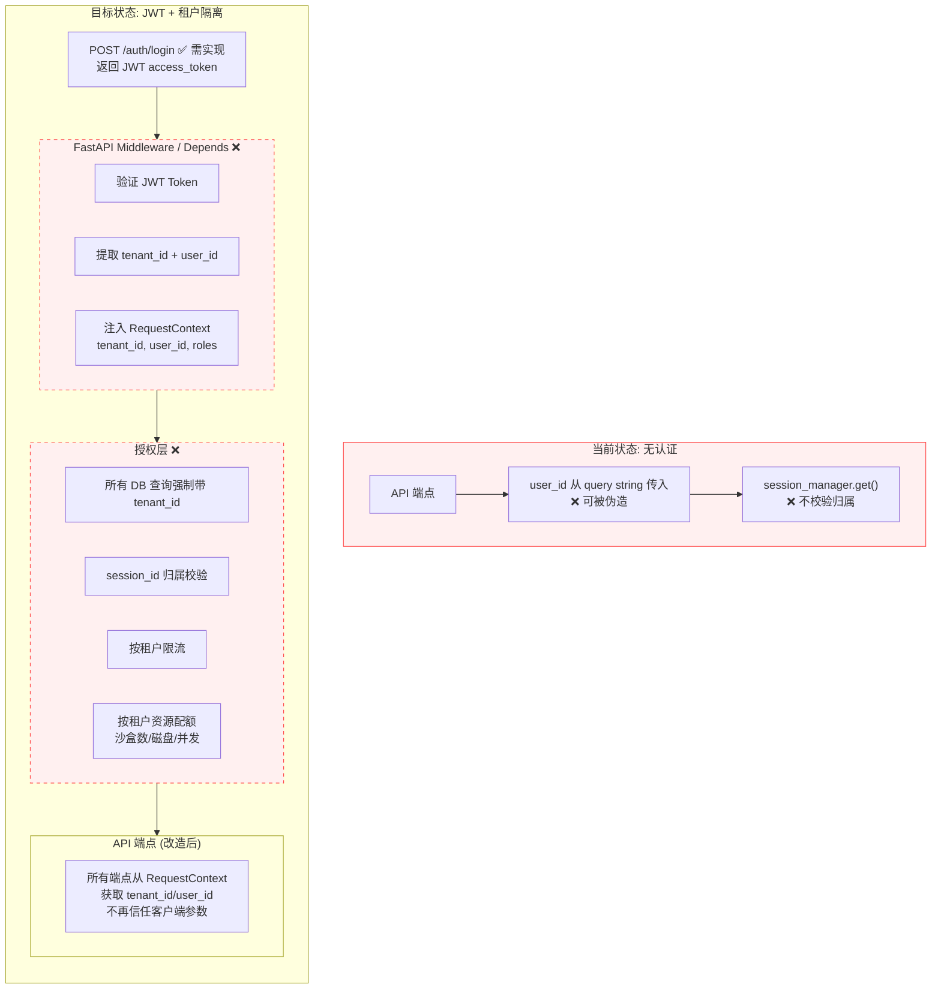
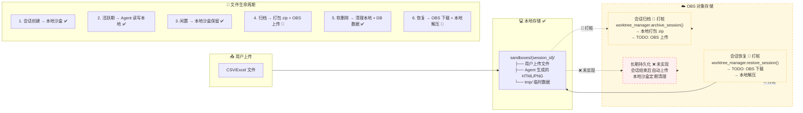
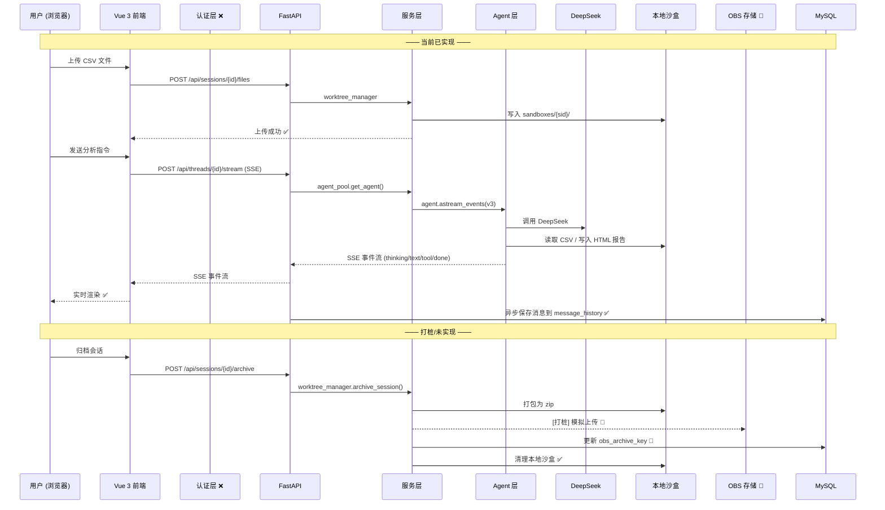
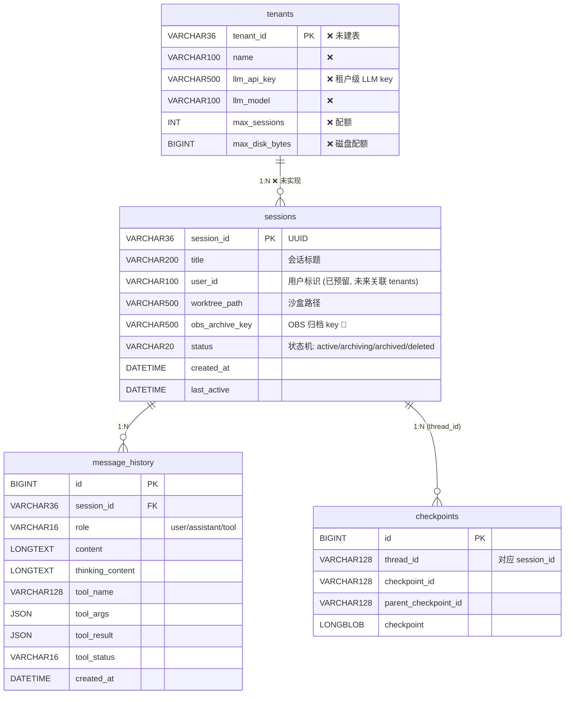

# data-analysis-agent 系统架构

> 更新日期: 2026-07-20

---

## 图例

| 标记 | 含义 |
|------|------|
| ✅ 实线框 | 已实现 |
| 🔶 虚线框 | 部分实现 (打桩/占位) |
| ❌ 红色虚线框 | 未实现 (规划中) |
| ── 实线箭头 | 已实现的数据流 |
| - - 虚线箭头 | 规划中/打桩的数据流 |

---

## 一、整体系统架构



---

## 二、认证授权详细架构 ❌ 全部未实现



### 改造要点

| 改造项 | 当前 | 目标 | 涉及文件 |
|--------|------|------|----------|
| 用户认证 | ❌ 无 | JWT + refresh token | 新增 `backend/auth/` |
| 租户隔离 | ❌ user_id 可伪造 | 所有查询加 `WHERE tenant_id = ?` | `session_manager.py`, `api/threads.py`, `api/files.py` |
| API 保护 | ❌ 全开放 | Depends(get_current_user) | `api/*.py`, `stream_handler.py`, `command_handler.py` |
| 会话权限 | ❌ 知道 ID 就能访问 | 校验 `session.tenant_id == request.tenant_id` | `session_manager.py` |
| 资源配额 | ❌ 无限制 | 按租户限制会话数、磁盘、并发 | 新增 `backend/quota.py` |

---

## 三、存储架构 (本地 + OBS)



### OBS 集成状态

| 功能 | 状态 | 实现文件 | 备注 |
|------|------|----------|------|
| 会话归档 (archive) | 🔶 打桩 | `worktree_manager.py:100-120` | 本地 zip 打包完成，OBS 上传为 `logger.info("[OBS打桩]")` |
| 会话恢复 (restore) | 🔶 打桩 | `worktree_manager.py:122-140` | 仅检查本地 zip 是否存在，OBS 下载未实现 |
| `obs_archive_key` 记录 | ✅ | `session_manager.py:120-129` | DB 字段已就绪 |
| 会话结束时自动归档 | ❌ | — | 需在 `soft_delete()` 或定时任务中触发 |
| 长期持久化 | ❌ | — | 活跃会话数据仍在本地，无异地备份 |
| OBS SDK 集成 | ❌ | — | 需引入 `boto3` 或华为云 OBS SDK |

---

## 四、数据流 (全链路)



---

## 五、数据库 ER 图



---

## 六、实现状态总览

| 模块 | 子功能 | 状态 | 优先级 |
|------|--------|------|--------|
| **认证** | JWT 登录 | ❌ | P0 |
| | Token 刷新 | ❌ | P0 |
| | 租户上下文注入 | ❌ | P0 |
| **授权** | 会话归属校验 | ❌ | P0 |
| | API 端点保护 | ❌ | P0 |
| | 资源配额 | ❌ | P1 |
| **存储** | 本地沙盒创建/删除 | ✅ | — |
| | 文件上传/预览 | ✅ | — |
| | OBS 归档 (上传) | 🔶 | P1 |
| | OBS 恢复 (下载) | 🔶 | P1 |
| | 自动持久化 | ❌ | P2 |
| **Agent** | deepagents 工厂 | ✅ | — |
| | Agent 缓存池 | ✅ | — |
| | data-analyst 子代理 | ✅ | — |
| | SSE 流式输出 (v3) | ✅ | — |
| **会话** | CRUD | ✅ | — |
| | 软删除 + 级联清理 | ✅ | — |
| | 归档/恢复 | 🔶 | P1 |
| **协议** | Protocol v2 类型 | ✅ | — |
| | /stream SSE 端点 | ✅ | — |
| | /commands 端点 | 🔶 | P2 |
| **数据库** | sessions 表 | ✅ | — |
| | message_history 表 | ✅ | — |
| | checkpointer 三表 | ✅ | — |
| | tenants 表 | ❌ | P0 |
| | tenant_api_keys 表 | ❌ | P1 |

---

## 七、依赖关系

```
Python 依赖 (requirements.txt):
├── fastapi==0.115.12        ← Web 框架
├── langgraph>=1.0.5         ← Agent 状态图
├── langchain>=1.2.0         ← LLM 工具链
├── deepagents>=0.6.0        ← Agent 工厂 (CompositeBackend + skills)
├── pymysql                  ← MySQL 驱动
├── pandas + openpyxl        ← 数据分析
├── matplotlib               ← 图表生成
├── uvicorn[standard]        ← ASGI 服务器
├── python-multipart + aiofiles ← 文件上传
├── python-dotenv            ← 环境变量
└── langchain-openai         ← DeepSeek 适配 (OpenAI 兼容)

前端依赖 (package.json):
├── vue@3                    ← UI 框架
├── vue-router@4             ← 路由
├── pinia@4                  ← 状态管理
├── @microsoft/fetch-event-source ← SSE 客户端
├── marked                   ← Markdown 渲染
└── highlight.js             ← 代码语法高亮
```
