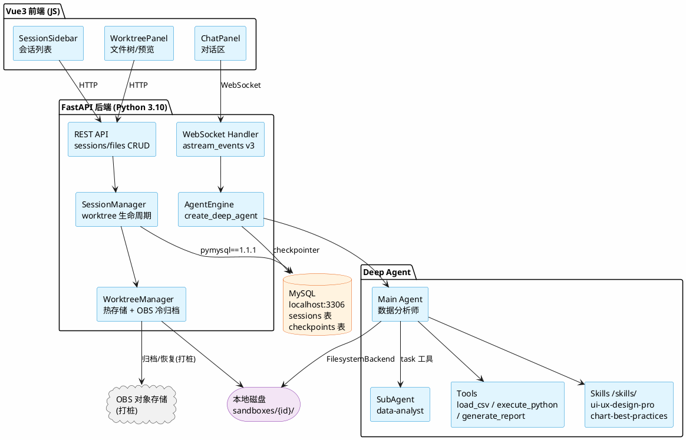
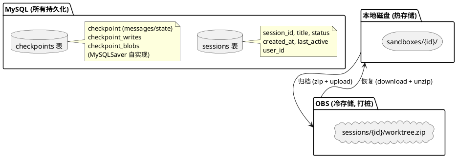
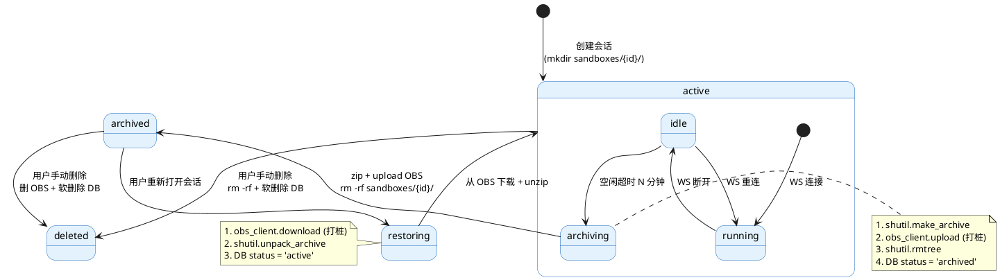
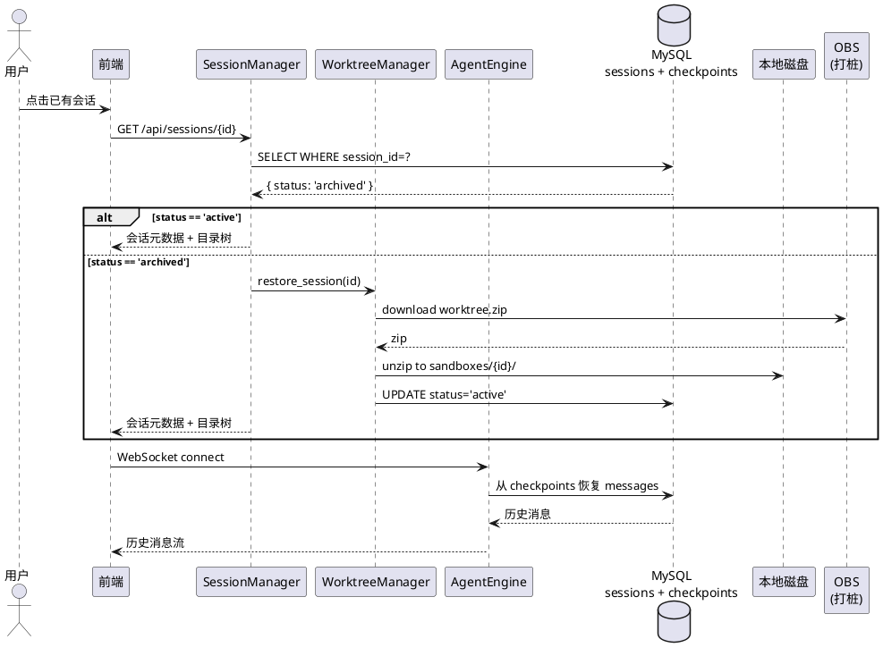
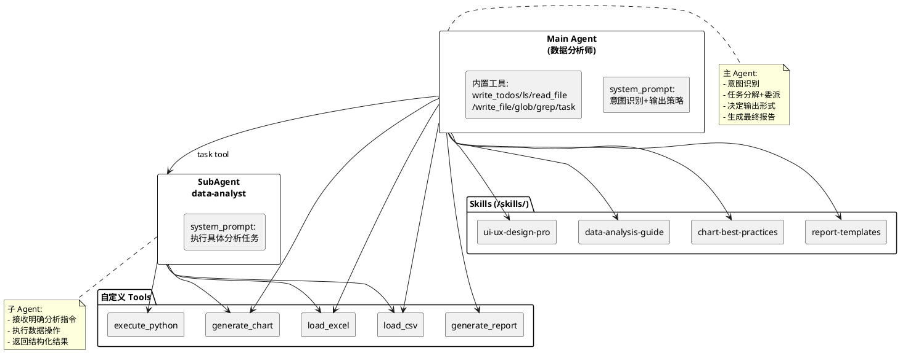
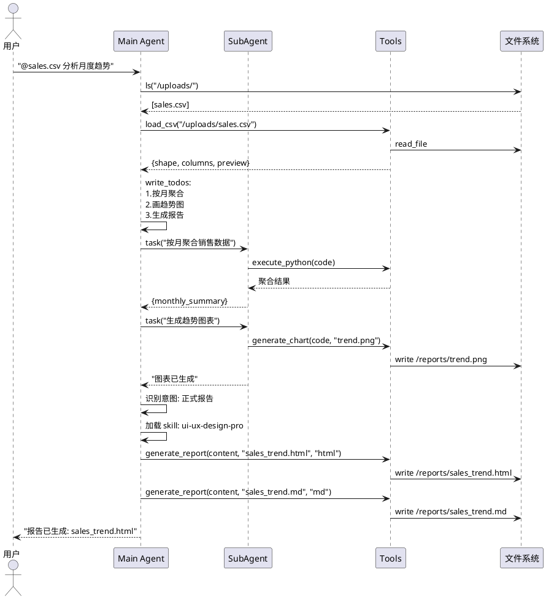
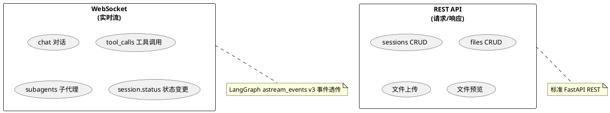

# 数据分析 Agent 系统设计文档

> 版本: v1.0 | 日期: 2026-07-18 | 状态: 待评审

---

## 1. 系统架构总览



---

## 2. 技术栈

| 层 | 技术 | 版本 |
|----|------|------|
| 前端 | Vue3 + JS | - |
| 前端路由 | Vue Router | - |
| 状态管理 | Pinia | - |
| 后端框架 | FastAPI | 0.115.12 |
| Agent 框架 | deepagents (LangGraph) | - |
| Agent 运行时 | LangGraph | 1.0.5 |
| LLM 框架 | LangChain | 1.2.0 |
| Python | 3.10 (conda py310) | 3.10 |
| 元数据库 | MySQL + pymysql | 1.1.1 |
| 对话持久化 | MySQL (MySQLSaver, 自实现) | - |
| 通信协议 | WebSocket + LangGraph astream_events v3 | - |
| 冷存储 | OBS 对象存储 (打桩) | - |

---

## 3. 数据模型

### 3.1 MySQL 表结构

#### sessions 表（业务元数据）

```sql
CREATE TABLE sessions (
    session_id    VARCHAR(36) PRIMARY KEY,          -- UUID
    title         VARCHAR(200) DEFAULT '新会话',     -- 会话标题
    user_id       VARCHAR(100) DEFAULT '',            -- 用户标识 (token/cookie 在请求头鉴权用)
    obs_archive_key VARCHAR(500) DEFAULT '',        -- OBS 归档文件 key (打桩预留)
    status        VARCHAR(20) DEFAULT 'active',     -- active/archiving/archived/restoring/deleted
    created_at    DATETIME DEFAULT CURRENT_TIMESTAMP,
    last_active   DATETIME DEFAULT CURRENT_TIMESTAMP,
    INDEX idx_status (status),
    INDEX idx_last_active (last_active)
);
```

#### checkpoints 表（LangGraph 对话状态，MySQLSaver 自实现）

参考 SqliteSaver 源码实现，建 3 张表：

```sql
-- 核心：每个 thread_id 对应一个 checkpoint
CREATE TABLE checkpoints (
    thread_id       VARCHAR(255) NOT NULL,
    checkpoint_ns   VARCHAR(255) NOT NULL DEFAULT '',
    checkpoint_id   VARCHAR(255) NOT NULL,
    parent_checkpoint_id VARCHAR(255),
    type            VARCHAR(255),
    checkpoint      LONGBLOB NOT NULL,       -- 序列化的 agent state
    metadata        LONGBLOB,                -- 序列化的 checkpoint metadata
    PRIMARY KEY (thread_id, checkpoint_ns, checkpoint_id)
);

-- checkpoint 挂起的写入操作
CREATE TABLE checkpoint_writes (
    thread_id       VARCHAR(255) NOT NULL,
    checkpoint_ns   VARCHAR(255) NOT NULL DEFAULT '',
    checkpoint_id   VARCHAR(255) NOT NULL,
    task_id         VARCHAR(255) NOT NULL,
    idx             INT NOT NULL,
    channel         VARCHAR(255) NOT NULL,
    type            VARCHAR(255),
    value           LONGBLOB,
    PRIMARY KEY (thread_id, checkpoint_ns, checkpoint_id, task_id, idx)
);

-- checkpoint 大对象 blob 存储
CREATE TABLE checkpoint_blobs (
    thread_id       VARCHAR(255) NOT NULL,
    checkpoint_ns   VARCHAR(255) NOT NULL DEFAULT '',
    channel         VARCHAR(255) NOT NULL,
    version         VARCHAR(255) NOT NULL,
    type            VARCHAR(255),
    blob            LONGBLOB,
    PRIMARY KEY (thread_id, checkpoint_ns, channel, version)
);
```

> MySQLSaver 需实现 `langgraph.checkpoint.base.BaseCheckpointSaver` 协议，
> 参照 `langgraph/checkpoint/sqlite/__init__.py` 源码适配为 pymysql。

### 3.2 文件系统布局

```
sandboxes/
├── {session_id}/
│   ├── uploads/              ← 用户上传 CSV/Excel
│   ├── reports/              ← Agent 生成 HTML/MD/PNG
│   └── .agent_internal/      ← deepagents 内部文件
└── ...
```

### 3.3 存储分层



---

## 4. Worktree 生命周期

### 4.1 状态机



### 4.2 恢复流程



---

## 5. Agent 设计

### 5.1 Agent 架构



### 5.2 意图驱动输出策略

```
用户意图                 Agent 行为                      输出
──────────────────────────────────────────────────────────────
"看看数据" / "怎么样"    快速探索                       仅对话文本
"趋势" / "对比" / "分布" 分析 + 图表                    文本 + /reports/*.png
"生成报告" / "总结"      正式报告                        /reports/report.html + .md
"画个图"                 仅图表                         文本 + /reports/*.png
不确定                   分析回复 + 询问                 文本 + 确认是否生成报告
```

### 5.3 Skills 目录

```
skills/                        ← 项目根目录，Git 版本控制，所有会话共享
├── ui-ux-design-pro/
│   ├── SKILL.md               ← HTML 报告设计规范（配色/排版/模板）
│   └── templates/
│       ├── dashboard.html
│       ├── executive.html
│       └── detailed.html
├── data-analysis-guide/
│   └── SKILL.md               ← 分析方法论
├── chart-best-practices/
│   └── SKILL.md               ← 图表选型指南
└── report-templates/
    ├── SKILL.md
    ├── templates/
    └── assets/
        ├── style.css
        └── chart.js
```

Skills 通过 CompositeBackend 路由以只读方式挂载到每个 agent 的虚拟文件系统中。

### 5.4 典型分析流程



---

## 6. 通信协议

### 6.1 WebSocket 职责

基于 LangGraph `astream_events` v3 事件映射：

```
LangGraph event.method        → 前端 UI 组件
─────────────────────────────────────────
messages                      → ChatPanel 对话流
  └─ content-block-delta      → 逐字追加
tool_calls                    → TodoPanel / 状态栏
  ├─ write_todos              → 任务列表更新
  └─ generate_report          → 报告通知 + 刷新文件树
subagents                     → SubAgentCard 进度卡片
  ├─ status: started          → 显示进行中
  └─ output + completed       → 显示完成
```

### 6.2 REST API

```
会话管理:
  POST   /api/sessions                   创建会话
  GET    /api/sessions                   会话列表
  GET    /api/sessions/{id}              会话详情
  DELETE /api/sessions/{id}              删除会话
  POST   /api/sessions/{id}/archive      手动归档

文件管理:
  GET    /api/sessions/{id}/files        目录树
  POST   /api/sessions/{id}/files        上传文件 (multipart/form-data)
  DELETE /api/sessions/{id}/files/{path} 删除文件
  GET    /api/sessions/{id}/files/{path} 文件预览(内容)
```

### 6.3 职责分离



---

## 7. 前端设计

### 7.1 页面布局

```
┌──────────┬────────────────────────────┬─────────────────┐
│  左侧栏   │        中间对话区            │    右侧工作区     │
│  260px   │        flex: 1             │     360px       │
│          │                            │                 │
│ 会话列表  │   消息流                    │  [文件树] [预览]  │
│ 新建/切换 │   子代理进度卡片             │  标签切换        │
│ 删除     │   任务规划列表               │                 │
│          │   报告通知                  │  ┌─────────────┐ │
│          │                            │  │ 上传 删除     │ │
│          │   @文件引用   上传          │  │             │ │
│          │   [输入框]    [发送]        │  │ iframe 预览  │ │
│          │                            │  │ or MD 渲染   │ │
└──────────┘                            │  └─────────────┘ │
              └────────────────────────┘  └─────────────────┘
```

### 7.2 组件树

```
App.vue
├── SessionSidebar.vue
│   ├── SessionCreate.vue
│   └── SessionList.vue
│       └── SessionItem.vue
│
├── ChatPanel.vue
│   ├── ChatHeader.vue
│   ├── ChatMessages.vue
│   │   ├── MessageBubble.vue
│   │   │   ├── TextContent.vue (Markdown)
│   │   │   └── FileMention.vue (@文件)
│   │   ├── SubAgentCard.vue
│   │   ├── TodoPanel.vue
│   │   └── ReportCard.vue
│   └── ChatInput.vue
│       ├── MentionDropdown.vue
│       └── FileUploadBtn.vue
│
└── WorktreePanel.vue
    ├── PanelTabs.vue
    ├── FileTree.vue
    │   ├── FileTreeNode.vue
    │   └── FileContextMenu.vue
    └── FilePreview.vue
        ├── HtmlPreview.vue (iframe)
        ├── MarkdownPreview.vue (marked.js)
        └── ImagePreview.vue
```

### 7.3 Pinia Store

```
sessionStore:  sessions[], currentId
chatStore:     messages[], todos[], subagents{}, ws, isStreaming
fileStore:     tree[], previewPath, previewContent
```

### 7.4 前端技术选型

| 需求 | 方案 |
|------|------|
| 框架 | Vue3 + JS |
| 路由 | Vue Router (`/session/:id`) |
| 状态管理 | Pinia |
| WebSocket | 原生 WebSocket + 自动重连 |
| Markdown | marked + highlight.js |
| 文件树 | 手写递归组件 |
| HTTP | fetch / axios |

---

## 8. 目录结构

```
data-analysis-agent/
├── backend/
│   ├── main.py                ← FastAPI 入口
│   ├── config.py              ← 配置 (DB 连接等)
│   ├── session_manager.py     ← 会话 CRUD + MySQL
│   ├── worktree_manager.py    ← 冷热归档 (OBS 打桩)
│   ├── agent_engine.py        ← deep agent 创建 + 调用
│   ├── agent_pool.py          ← agent 实例缓存池
│   ├── ws_handler.py          ← WebSocket 处理 + astream_events
│   ├── api/
│   │   ├── sessions.py        ← REST: sessions CRUD
│   │   └── files.py           ← REST: files CRUD
│   └── tools/
│       ├── data_tools.py      ← load_csv/excel, execute_python
│       └── report_tools.py    ← generate_report, generate_chart
│
├── skills/                    ← 系统级 Skill（Git 版本控制）
│   ├── ui-ux-design-pro/
│   │   ├── SKILL.md
│   │   └── templates/
│   ├── data-analysis-guide/
│   │   └── SKILL.md
│   ├── chart-best-practices/
│   │   └── SKILL.md
│   └── report-templates/
│       ├── SKILL.md
│       ├── templates/
│       └── assets/
│
├── sandboxes/                 ← 用户会话数据 (.gitignore)
│   └── {session_id}/
│       ├── uploads/
│       └── reports/
│
├── frontend/
│   ├── src/
│   │   ├── App.vue
│   │   ├── main.js
│   │   ├── router/
│   │   ├── stores/
│   │   │   ├── sessionStore.js
│   │   │   ├── chatStore.js
│   │   │   └── fileStore.js
│   │   ├── components/
│   │   │   ├── SessionSidebar.vue
│   │   │   ├── ChatPanel.vue
│   │   │   ├── ChatMessages.vue
│   │   │   ├── ChatInput.vue
│   │   │   ├── WorktreePanel.vue
│   │   │   ├── FileTree.vue
│   │   │   └── FilePreview.vue
│   │   └── utils/
│   │       └── websocket.js
│   ├── index.html
│   └── package.json
│
├── docs/
│   └── superpowers/
│       └── specs/
│           └── 2026-07-18-data-analysis-agent-design.md
│
├── AGENTS.md
└── README.md
```

---

## 9. 设计决策汇总

| # | 决策 | 方案 |
|---|------|------|
| 1 | 沙盒 | FilesystemBackend, sandboxes/{id}/, virtual_mode=True |
| 2 | 会话鉴权 | Session ID + user_id, token/cookie 在请求头鉴权 |
| 3 | 通信协议 | WebSocket + LangGraph astream_events v3 + REST API |
| 4 | 存储 - 元数据 | MySQL 8, pymysql==1.1.1, localhost:3306, password:123456 |
| 5 | 存储 - 对话 | MySQL (MySQLSaver, 自实现 BaseCheckpointSaver) |
| 6 | Worktree 生命周期 | 本地热存储 + OBS 冷归档 (OBS 打桩) |
| 7 | 分析工具 | 自定义 Python tools + data-analyst 子代理 |
| 8 | 报告生成 | 意图驱动, HTML/MD/PNG 按需生成 |
| 9 | Skill 体系 | 系统级 /skills/ 目录, CompositeBackend 路由, 只读 |
| 10 | 布局 | 左 260px | 中 flex:1 | 右 360px |
| 11 | 前端 | Vue3+JS, Vue Router, Pinia, 原生 WebSocket |
| 12 | 冷存储 | OBS 归档/恢复 (打桩, 预留接口) |
